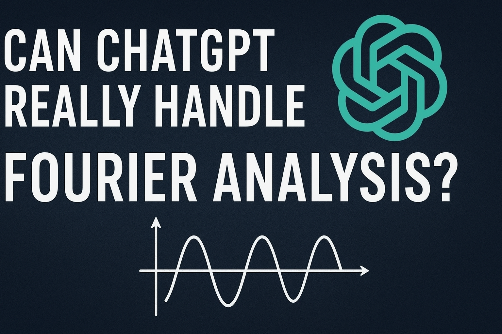

#  Can ChatGPT Really Handle Fourier Analysis?

Let’s find out! ChatGPT claims it can explain the theory, derive formulas, compute Fourier coefficients, and even write Python code to visualize Fourier series for functions like square and sawtooth waves. But can it really? The best way to know is to put it to the test and see the results for yourself.


```python code
import numpy as np
import matplotlib.pyplot as plt

# Define x-axis values
x = np.linspace(-np.pi, np.pi, 1000)

# Original square wave function
# Square wave: +1 for x in (0, π), -1 for x in (-π, 0)
square_wave = np.sign(np.sin(x))

# Fourier series approximation of square wave
approx = np.zeros_like(x)
terms = 10  # Number of Fourier terms

for n in range(1, 2*terms, 2):  # odd harmonics only
    approx += (4 / (np.pi * n)) * np.sin(n * x)

# Plotting
plt.figure(figsize=(8, 5))
plt.plot(x, square_wave, label="Original Square Wave", color="black", linewidth=2)
plt.plot(x, approx, label=f"Fourier Approximation (n={terms} terms)", color="red")
plt.title("Square Wave using Fourier Series")
plt.xlabel("x")
plt.ylabel("f(x)")
plt.grid(True)
plt.legend()
plt.show()
```


```python code
import numpy as np
import matplotlib.pyplot as plt

x = np.linspace(-np.pi, np.pi, 1000)
f = x  # sawtooth
approx = np.zeros_like(x)

for n in range(1, 50):
    approx += (2 * ((-1)**(n+1)) / n) * np.sin(n*x)

plt.plot(x, f, label='Original Function')
plt.plot(x, approx, label='Fourier Approximation (n=50)')
plt.legend()
plt.show()
```


It seems that ChatGPT is highly capable when it comes to Fourier analysis. It can accurately compute Fourier coefficients and generate correct Python code to plot partial Fourier sums for different values of N. Whether you’re exploring a square wave, sawtooth wave, or any other periodic function, ChatGPT can guide you through both the mathematics and the implementation with precision.
