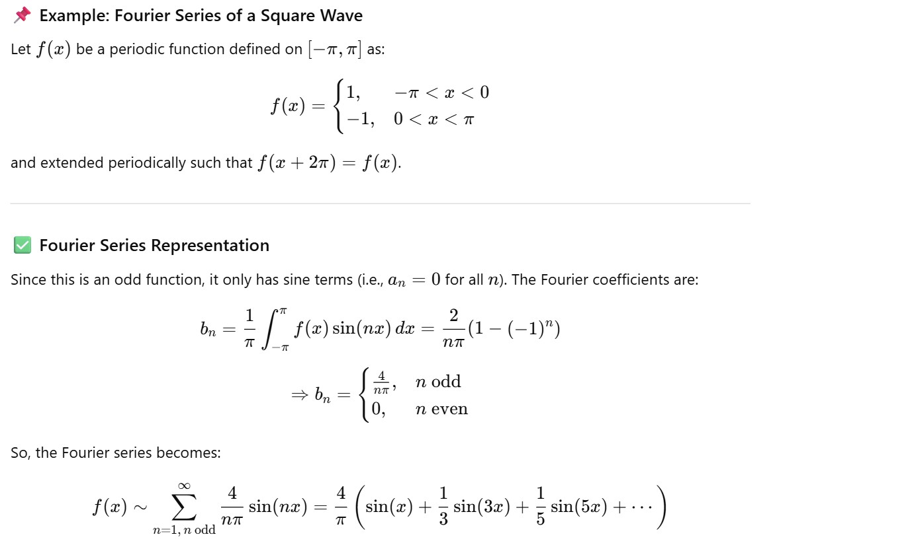

#  Can ChatGPT Really Handle Fourier Analysis?
Let’s find out! ChatGPT claims it can explain the theory, derive formulas, compute Fourier coefficients, and even write Python code to visualize Fourier series for functions like square and sawtooth waves. But can it really? The best way to know is to put it to the test and see the results for yourself.



```python code
import numpy as np
import matplotlib.pyplot as plt

x = np.linspace(-np.pi, np.pi, 1000)
f = x  # sawtooth
approx = np.zeros_like(x)

for n in range(1, 50):
    approx += (2 * ((-1)**(n+1)) / n) * np.sin(n*x)

plt.plot(x, f, label='Original Function')
plt.plot(x, approx, label='Fourier Approximation (n=50)')
plt.legend()
plt.show()
```


